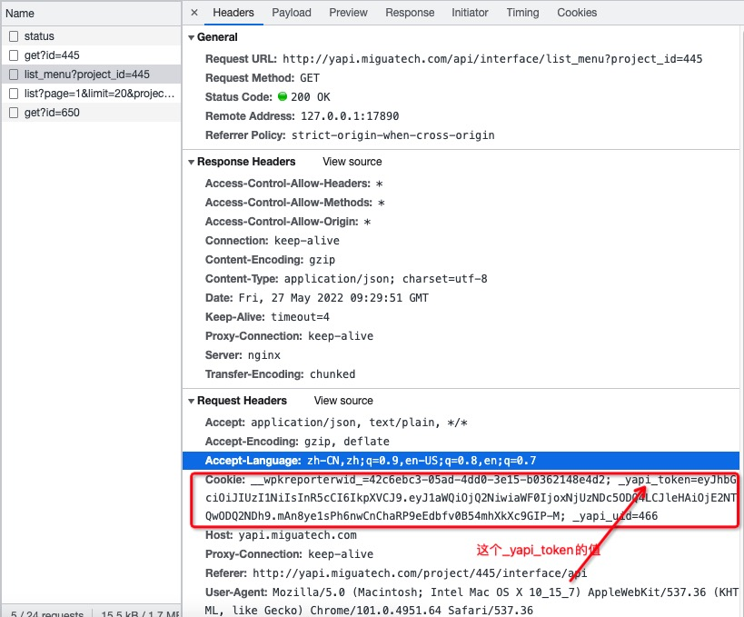
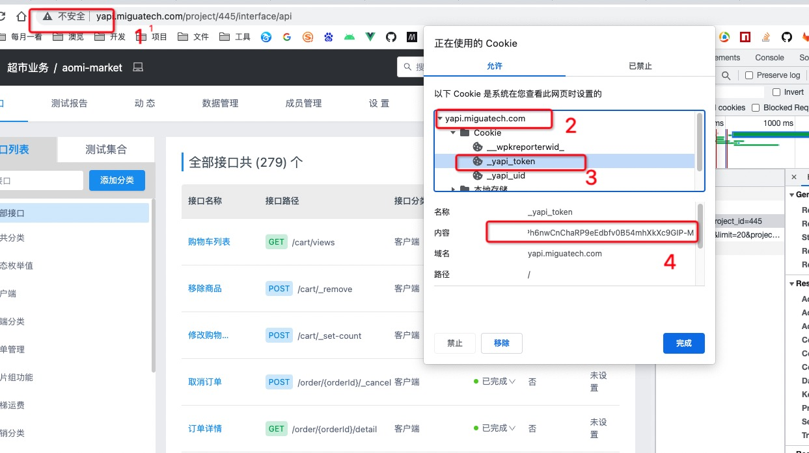
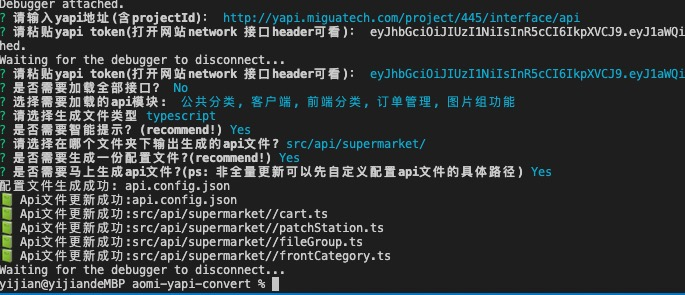
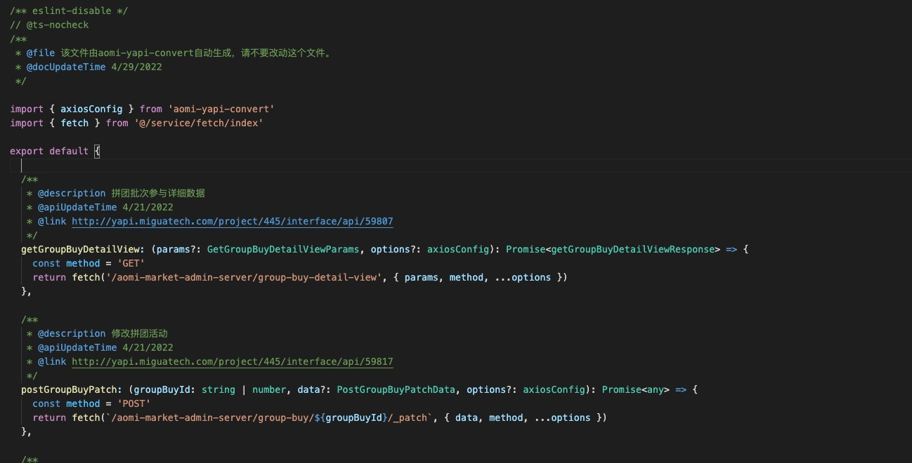
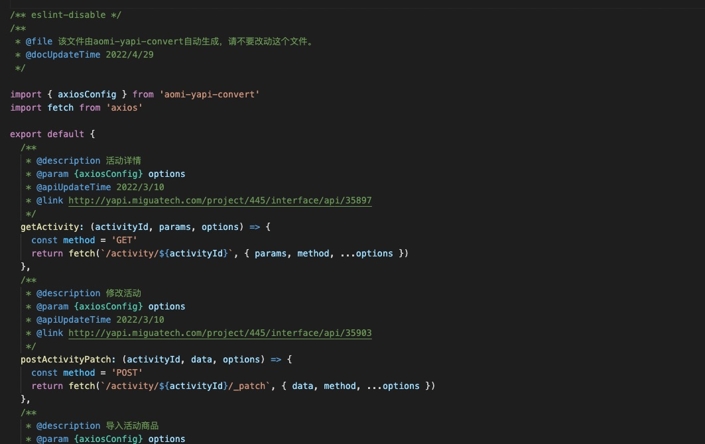
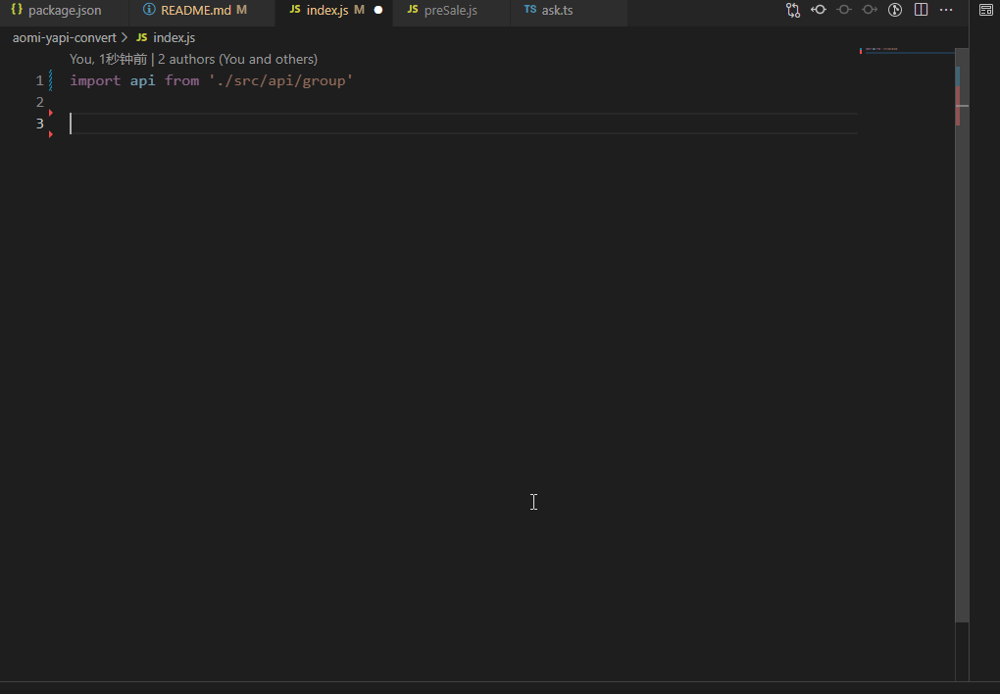

# aomi-yapi-convert 

[](https://www.npmjs.com/package/aomi-yapi-convert)
[](https://www.npmjs.com/package/aomi-yapi-convert)

> 针对yapi文档转js或者ts文件的自动化npm插件

## 演示地址

功能体验地址: [http://yapi.theapi.world/](http://yapi.theapi.world/)

## 功能

1. 支持转ts、js API文件
2. js文件支持jsDoc版本和simple注释版本
3. ts文件支持Ts版本和simple注释版本
4. 支持自定义配置生成api文件位置
5. 支持自定义配置axios路径和axiosName来配置个人封装的请求框架
6. 支持自定义配置baseUrl,不配置默认取项目的baseUrl(服务端不一定会有)
7. 支持自定义配置生成api文件名
8. 支持增加任意自定义形参及默认值
9. 支持根据个人风格偏好选择导出文件导出的格式

## 这个工具能帮你做些什么？

1. 帮你完成交互搬运工作
2. 减少你经常搬运错误的情况
3. 获得来自后台同事为你写的字段以及参数提示，不用频繁来回切文档页面去看文档
4. 获得来自axios的配置提示，避免老是忘记配置项参数要去看文档的问题
5. api文件即是注释，api文件即是文档，获得良好的开发体验
6. 具备让你代码联调之前，只要API文档出来了，你的代码就具有获得具体字段名称的能力

## 安装

Using npm: 

```bash
$ npm install aomi-yapi-convert --save-dev

```

Using yarn: 

```bash
$ yarn add aomi-yapi-convert -D

```


### 怎么使用

如果不想在package.json里面添加额外的script,可以在终端运行下方命令，会自动触发交互命令行，生成配置文件

```bash
$ npx aomi-yapi-convert
```

虽然上面的命令也能满足使用，但是毕竟不方便也不太好记，每次更新都要打一遍，还是推荐在项目package.json添加script:

```
 "scripts": {
    "build:api": "aomi-yapi-convert",
  },
```


首次构建本地配置文件，会询问你几个问题，然后作为依据来生成配置文件（配置文件推荐将其添加为gitignore文件。不会干扰其他开发人员开发，特别是项目大的时候，每个人的对应的项目加起来配置文件将会很长。）

下面开始来解释一下几个有必要的问题，以及需要的输入：

* 请输入yapi地址(含projectId)： 这个只需要粘贴yapi的具体项目地址过来就可以了
* 请粘贴yapi token(打开网站network 接口header可看)： 这个token是api请求携带的token.可以通过接口请求header看或者看网站的cookie。截图如下：



## 或者



* 请输入yapi userId (打开网站network 接口header可看_yapi_uid值)：token和userId对应，否则登录状态将会失效

以添加script为示例，我们看下实际生成的效果



然后你就会发现在根目录会生成一个api.config.json的配置文件。目前暂时的配置约定是这样的

### Api配置

|参数名称|类型|默认值|备注|
|---|---|---|---|
|protocol|string||协议头https: 或http: 由文档地址决定
|host|string||example: baidu.com
|version|string||typescript(ts)|javascript(js) 两种版本，type类型分别是TsType类型和jsdoc类型
|axiosFrom|string|import fetch from 'axios'|这里配置自定义的请求目录，考虑到大部分时候我们都用axios的包，所以使用axios作为默认请求，你也可以使用自定义的请求。
|axiosName|string|fetch|这里配置自定义的请求Name,这里改成ssr的this指针挂载方式
|dataParseName|string|detailMsg|这里配置服务端统一返回的数据结构开始序列的对应key信息
|isNeedType|boolean|true|这里设置是否需要js doc类型，建议设置为true。会有非常完善的提示，来自后台的配置注释我迁移过来了
|isNeedAxiosType|boolean|true|这里设置是否需要axios的插件提示，默认为false, 如果设置为true, axios的额外配置项的类型提示将会是插件引入的axios提示.
|isNeedSecondType|boolean|true|可以设置false不加载二层分类 
|customerSnippet|string[]||用户自定义片段，字符串数组，每项占据一行
|customer|Array<{name: string, default: ''}>||这里设置自定义的参数类型，该类型会添加进入请求的形参,支持传入任意数量形参，建议使用project里面的来定义，可能存在同一个项目调用不同的业务线api的情况
|outputStyle|string|defaultExport|支持值defaultExport, nameExport, anonymousExport,分别对应了默认导出，具名导出，匿名函数导出
|projects|project[]||project配置见下表

### Project 配置

|参数名称|类型|默认值|备注|
|---|---|---|---|
|projectId|number||项目id
|outputDir|string||统一的文件生成路径，请注意默认文件夹是src/api目录，如果该目录下已经有文件了，建议在该目录起一个子目录名称：ep: src/api/auto/.
|isLoadFullApi|boolean||这里配置是否全量加载api文件，原有项目已经有api的文件，请设置为false局部更新，全量更新会生成重复代码，徒增冗余
|hideUnDoneApi|boolean||这里配置是否加载服务端接口显示未完成的Api。开发期间Api接口可能还是未完成状态。方便前端调试,默认加载。
|prefix|string||一般该项设置为空，但我注意到部分接口服务端不配置服务名（比如超市的接口），需要前端手动添加，所以加了该配置项。这个配置项加了之后会在该项目组下所有接口添加这个字符串
|customer|Array<{name: string, default: ''}>|| 这里设置自定义的参数类型，该类型会添加进入请求的形参,支持传入任意数量形参，不设置会默认继承全局的。
|group|Array<{catId: number, outputDir: string, fileName: ''}>|| {          catId: 后台项目下的菜单id   outputDir: 可以自定义生成文件路径，不设置继承project的路径   fileName:  如果不喜欢程序生成的文件名可以自定义文件名        }


好了，走到一步了，如果没有出现意外的话，你会在src/api（如果输出文件路径没有修改的话）目录下看到由插件自动化生成api文件。示例(ts/js)：




然后就可以愉快使用了。使用的时候将会获得非常良好的提示体验。

使用示例：

